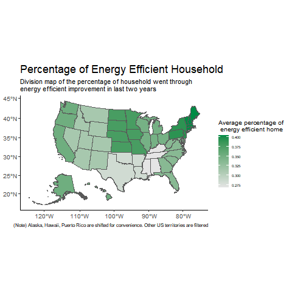

```{r setup, include=FALSE}
setwd("/Users/chenjunzhuo/Documents/GitHub/final-project-xiaoqi-ellie-lee/images/")
```

## First level title

- **Second level title**

```{r, echo=FALSE, out.width="50%", fig.cap="A nice image."}
# use echo=FALSE to hide the code

```

## Including Plots

```{r, echo=FALSE,out.width="40%", out.height="40%",fig.cap="caption", fig.show='hold',fig.align='center'}
knitr::include_graphics(c("map_energy_efficient_home.png","map_elec.png"))
```

Note that the `echo = FALSE` parameter was added to the code chunk to prevent printing of the R code that generated the plot.
